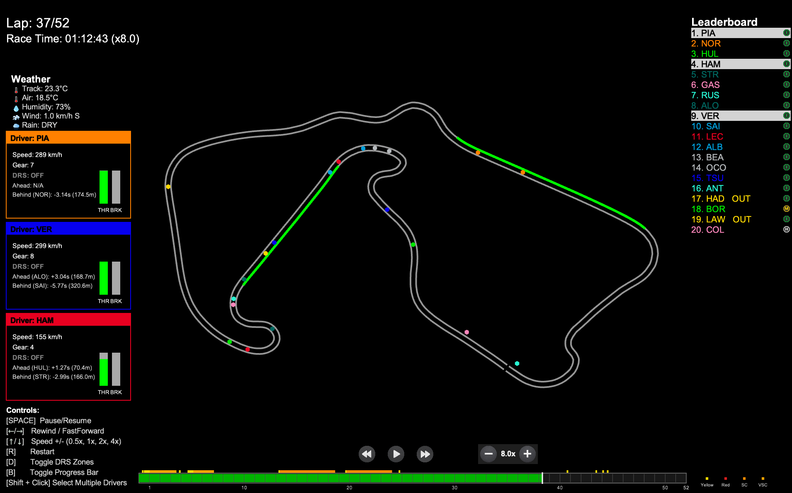

# F1 Vision

A race-engineering analytics platform built on [FastF1](https://github.com/theOehrly/Fast-F1) — combining a real-time race replay visualizer with a machine-learning tyre degradation model and Bayesian in-race tyre health tracking.

Forked from [IAmTomShaw/f1-race-replay](https://github.com/IAmTomShaw/f1-race-replay), extended with a tyre degradation modelling pipeline and a Bayesian tyre-health integration layer.



## What this project does

1. **Race Replay** — Watch any F1 race (2018–present) unfold visually: real driver positions on the track, live leaderboard, tyre compounds, safety car deployment, pit stops.
2. **Tyre Degradation Model** — A machine learning pipeline trained on 10 real race sessions (2024–2025, 5 circuits) that predicts lap time delta from tyre age, compound, and track, using fuel-corrected lap times to isolate the tyre effect.
3. **Bayesian Tyre Health Tracking** — A Kalman-filter-based model that tracks tyre health lap-by-lap during a session, producing live health % and uncertainty estimates.

## Tyre Degradation Model — Results

**Data:** 10 race sessions across 2024–2025 (Bahrain, Spain, Silverstone, Hungary, Monaco), chosen to span high, medium, and low tyre degradation circuits.

- Total raw laps: 11,940
- Clean laps used for modelling: 10,384 (after filtering safety car laps, pit laps, and outliers)
- Features: tyre age, compound, stint number, lap number, track, degradation category, clean-air flag
- Target: fuel-corrected lap time delta from race median (isolates tyre effect from fuel burn-off)

**Baseline models (Linear / Polynomial regression, per compound):**

| Compound | Linear RMSE | Poly-2 RMSE | Poly-3 RMSE |
|----------|------------:|------------:|------------:|
| SOFT     | 6.59s       | 6.57s       | 6.57s       |
| MEDIUM   | 4.38s       | 4.37s       | 4.33s       |
| HARD     | 4.23s       | 4.22s       | 4.16s       |

**XGBoost global model (5-fold cross-validation):**

- **CV RMSE: 1.84 ± 0.19 seconds**
- **CV R²: 0.856 ± 0.023**
- **~72% reduction in RMSE vs. the best baseline** — the model explains 85.6% of variance in fuel-corrected lap time delta using tyre age, compound, and track context.

> Per-compound and per-track degradation slopes, plus feature importance rankings, are in progress — see [Known Issues](#known-issues) below.

### Why this is a meaningful result

Baseline per-compound regression treats tyre degradation as one fixed curve, but real degradation depends heavily on track (Monaco has near-zero degradation; Bahrain is severe). The high baseline RMSE — especially 6.6s for SOFT — reflects this: a single curve averaged across very different physical regimes fits none of them well. XGBoost, given track and stint context as features, cuts that error by roughly 72%, showing the model is learning genuine track-dependent degradation behaviour rather than fitting noise.

## Setup

```bash
git clone https://github.com/Karansarda-cell/F1-vision.git
cd F1-vision
python3.11 -m venv venv
source venv/bin/activate
pip install -r requirements.txt
```

## Running the Race Replay

```bash
# GUI menu — select year + round from interface
python main.py

# CLI menu
python main.py --cli

# Direct — specify year and round
python main.py --viewer --year 2025 --round 8

# Qualifying replay
python main.py --viewer --year 2025 --round 8 --qualifying
```

## Running the Tyre Degradation Model

```bash
python src/models/tyre_degradation_model.py
```

First run downloads and caches ~10 race sessions via FastF1 (takes several minutes). Subsequent runs use the local cache and are fast.

## Controls (Race Replay)

- **Pause/Resume:** SPACE or Pause button
- **Rewind/Fast Forward:** ← / → or buttons
- **Playback Speed:** ↑ / ↓ or Speed button (0.5x, 1x, 2x, 4x)
- **Set Speed Directly:** Keys 1–4
- **Restart:** R
- **Toggle DRS Zone:** D
- **Toggle Progress Bar:** B
- **Toggle Driver Names:** L
- **Select driver(s):** Click, or Shift+Click for multiple

## Project Structure

```
F1-vision/
├── main.py                          # Entry point for race replay
├── requirements.txt
├── README.md
├── src/
│   ├── f1_data.py                   # FastF1 data loading & processing
│   ├── bayesian_tyre_model.py       # Kalman-filter tyre health model
│   ├── tyre_degradation_integration.py
│   ├── f1_tyre_integration.py       # Column-mapping layer: FastF1 → Bayesian model
│   ├── models/
│   │   └── tyre_degradation_model.py # XGBoost + polynomial degradation model
│   ├── interfaces/
│   │   ├── race_replay.py           # Main race replay renderer
│   │   └── qualifying.py            # Qualifying session replay
│   ├── gui/, cli/, services/, insights/, lib/
├── outputs/                          # Generated plots & CSVs (gitignored data, committed results)
└── resources/
```

## Known Issues

- **Race leaderboard accuracy:** Inaccurate for the first few corners and briefly during pit stops, due to known telemetry position inaccuracies. Being improved in stages.
- **Tyre degradation model — per-track slope table:** The script currently errors when computing per-track feature importance (`ValueError: Length of values (8) does not match length of index (7)`), likely due to an XGBoost categorical-column auto-encoding mismatch. Global CV results (RMSE/R²) are unaffected and reported above. Fix in progress.

## Roadmap

- Sector time overlay (live delta to personal/session best, colour-coded like official F1 timing)
- Chase/drone camera modes for the replay
- Per-track degradation slope breakdown once the feature importance bug is resolved

## Credits

Built on [IAmTomShaw/f1-race-replay](https://github.com/IAmTomShaw/f1-race-replay). See [contributors.md](./contributors.md) for acknowledgements.
